# Architecture

## Architecture Decision Records

### ADR-001: Two-Service Architecture

**Context**: Separation of concerns between public API and internal business logic.

**Decision**: Split into two services:
- **api-gateway**: Public REST API, authentication, request validation
- **svc-devices**: Internal service with business logic and database access

**Consequences**:
- Clear responsibility separation
- Independent scaling
- gRPC for efficient inter-service communication

---

### ADR-002: API-First Development with OpenAPI

**Context**: Need consistent API contracts and documentation.

**Decision**: Use OpenAPI 3.1 specification as the source of truth:
- Define API contracts in YAML files
- Generate server stubs using oapi-codegen v2
- Serve Swagger UI for interactive documentation

**Consequences**:
- Single source of truth for API contracts
- Type-safe generated code
- Always up-to-date documentation

---

### ADR-003: PASETO for Authentication

**Context**: Need secure, stateless authentication for API access.

**Decision**: Use PASETO v4 (Platform-Agnostic Security Tokens):
- More secure defaults than JWT
- No algorithm confusion attacks
- Built-in versioning

**Consequences**:
- Stateless authentication
- Strong cryptographic defaults
- Token-based access control

---

### ADR-004: Traefik as Reverse Proxy

**Context**: Need TLS termination, routing, and observability for local development.

**Decision**: Use Traefik v3 as the entry point:
- TLS termination with local certificates
- Dynamic service discovery via Docker labels
- Built-in dashboard for debugging

**Consequences**:
- Consistent HTTPS in development and production
- Easy routing configuration
- Circuit breaker and rate limiting capabilities

---

### ADR-005: HashiCorp Vault for Secrets Management

**Context**: Need secure, centralized secrets management for all services.

**Decision**: Use HashiCorp Vault with AppRole authentication:
- Centralized secret storage with KV v2 engine
- Per-service policies with least-privilege access
- AppRole authentication for service-to-Vault communication
- Automated initialization via init container

**Consequences**:
- Secrets not stored in environment files or code
- Auditable access to sensitive data
- Dynamic credential rotation capability
- Service isolation through policies

---

### ADR-006: KeyDB for Caching

**Context**: Need high-performance caching layer for API responses and session data.

**Decision**: Use KeyDB (Redis-compatible) as the caching solution:
- Drop-in Redis replacement with better performance
- Persistent storage with periodic snapshots
- Password-protected access

**Consequences**:
- Reduced database load
- Faster response times for cached data
- Compatible with existing Redis clients

---

### ADR-007: Hexagonal Architecture (Ports and Adapters)

**Context**: Need a maintainable, testable architecture that isolates business logic from infrastructure concerns.

**Decision**: Adopt Hexagonal Architecture (also known as Ports and Adapters):
- **Domain Layer** (`domain/model/`): Core business entities and rules, no external dependencies
- **Ports** (`ports/`): Interface definitions that the domain exposes (inbound) or requires (outbound)
- **Adapters** (`adapters/`): Implementations that connect external systems to ports
  - Inbound adapters: HTTP handlers, gRPC handlers
  - Outbound adapters: Database repositories, external service clients
- **Use Cases** (`usecases/`): Application-specific business rules orchestrating domain and ports

**Consequences**:
- Business logic is isolated from frameworks and infrastructure
- Easy to test domain logic in isolation with mock adapters
- Flexible to swap implementations (e.g., change a database without touching business logic)
- Clear dependency direction: adapters depend on ports, never the reverse

---

### ADR-008: Command-Query Separation (CQS)

**Context**: Need clear separation between operations that modify state and those that only read state.

**Decision**: Apply [CQS pattern](https://en.wikipedia.org/wiki/Command%E2%80%93query_separation) in the use cases layer:
- **Commands** (`usecases/commands/`): Operations that change state (Create, Update, Delete)
- **Queries** (`usecases/queries/`): Operations that return data without side effects (Get, List)
- Each handler implements a single responsibility with a consistent interface
- Decorators (`shared/decorator/`) wrap handlers for cross-cutting concerns (logging, metrics, tracing)

**Consequences**:
- Clear intent: readers know immediately if an operation modifies the state
- Easier optimization: queries can be cached, commands trigger cache invalidation
- Simplified testing: commands and queries can be tested independently
- Natural fit for event sourcing or CQRS evolution if needed

---

### ADR-009: Cache-Aside Pattern at Query Decorator Level

**Context**: Need efficient caching for device data to reduce the database load and improve response times, while maintaining cache consistency.

**Decision**: Implement Cache-Aside pattern at the Query Decorator level in the API Gateway:
- Cache at the **application layer** (Query decorators), not HTTP middleware
- Use semantic cache keys (device ID) rather than URL-based keys
- Async cache writes to avoid blocking responses
- Automatic invalidation from Command handlers

**Alternatives Considered**:
1. **HTTP Middleware caching**: Rejected - URL-based keys make invalidation difficult
2. **Service-level cache (svc-devices)**: Rejected - still pays gRPC overhead on cache hits
3. **Two-tier cache (L1 gateway, L2 service)**: Rejected - YAGNI, complex cache coherency

**Consequences**:
- Cache hits bypass gRPC calls entirely
- Easy invalidation by device ID
- Full observability (cache hits/misses are logged, metriced, traced)
- Decorator order ensures: `logging → metrics → tracing → cache → base`

---

### ADR-010: ETag-Based Conditional GET

**Context**: Need HTTP caching support to reduce bandwidth and allow clients to validate cached responses.

**Decision**: Implement ETag generation and conditional GET:
- Generate ETags using xxhash for performance
- Support `If-None-Match` header for conditional requests
- Return `304 Not Modified` when ETag matches

**Consequences**:
- Reduced bandwidth for unchanged resources
- Client-side caching enabled via `Cache-Control` headers
- Compatible with CDN and proxy caches

---

### ADR-011: Shared Infrastructure Packages

**Context**: Cross-cutting concerns like circuit breakers, logging, metrics, and decorators are needed across multiple services. Duplicating this code violates DRY and makes maintenance difficult.

**Decision**: Extract reusable infrastructure code to `pkg/` as shared packages:
- **`pkg/circuitbreaker`**: Generic circuit breaker with configurable thresholds and type-safe execution
- **`pkg/decorator`**: Command/Query decorators for logging, metrics, tracing, and caching
- **`pkg/logger`**: Structured logging with zerolog
- **`pkg/metrics`**: OpenTelemetry metrics abstraction
- **`pkg/idempotency`**: Idempotency key generation and context helpers

**Design Principles**:
- Packages have no dependencies on service-specific code
- Use Go generics where type safety improves API ergonomics
- Define sentinel errors in the package (e.g., `circuitbreaker.ErrCircuitOpen`)
- Keep domain models clean - infrastructure errors don't belong in domain

**Consequences**:
- Single source of truth for cross-cutting concerns
- Services map their config to generic package configs at the boundary
- Domain models remain pure business concepts
- Easier to test infrastructure in isolation

---

## C4 Model Diagrams

The following diagrams follow the [C4 Model](https://c4model.com/) for visualizing software architecture, progressing from high-level context (L1) to detailed components (L3).

### C4 Level 1: System Context

Shows the Devices API system and its relationships with external actors and systems.

```mermaid
graph TB
    subgraph ext [External Actors]
        User["👤 API Consumer<br/>[Person]<br/>Manages device inventory"]
    end

    subgraph obs [Observability]
        OTEL["📊 OpenTelemetry Collector<br/>[External System]<br/>Receives traces and metrics"]
    end

    subgraph sys ["Devices API System [Software System]"]
        API["🔌 Devices Management API<br/>Provides RESTful API for<br/>device CRUD operations"]
    end

    subgraph infra [Infrastructure Services]
        Vault[("🔐 HashiCorp Vault<br/>[External System]<br/>Secrets management")]
        KeyDB[("⚡ KeyDB<br/>[External System]<br/>Response caching")]
        Postgres[("🗄️ PostgreSQL<br/>[External System]<br/>Device persistence")]
    end

    User -->|"HTTPS/REST<br/>Device operations"| API
    API -->|"OTLP<br/>Traces, Metrics"| OTEL
    API -->|"Vault API<br/>Fetch secrets"| Vault
    API -->|"Redis Protocol<br/>Cache read/write"| KeyDB
    API -->|"SQL/pgx<br/>Device CRUD"| Postgres
```

### C4 Level 2: Container Diagram

Zooms into the Devices API system showing the deployable containers and their interactions.

### C4 Level 3: api-gateway Components

Zooms into the api-gateway container showing internal components and their relationships.

```mermaid
graph TB
    subgraph "api-gateway [Container]"
        subgraph inbound [Inbound Adapters]
            Router["🛣️ HTTP Router<br/>[Component: Chi]<br/>Route registration"]
            MW["🔒 Middleware Pipeline<br/>[Component]<br/>Auth, RateLimit, Idempotency,<br/>ETag, CORS, Recovery"]
            Handlers["📡 HTTP Handlers<br/>[Component]<br/>Devices, Admin, Health"]
        end

        subgraph usecases [Use Cases - CQRS]
            Commands["✏️ Commands<br/>[Component]<br/>Create, Update,<br/>Patch, Delete"]
            Queries["🔍 Queries<br/>[Component]<br/>Get, List, Health"]
            Decorators["🎀 Decorators<br/>[Component]<br/>Logging, Metrics,<br/>Tracing, Cache"]
        end

        subgraph outbound [Outbound Adapters]
            GRPCClient["📤 DevicesService<br/>[Component: gRPC Client]<br/>Circuit Breaker, Retry"]
            CacheRepo["💾 DevicesCache<br/>[Component: Repository]<br/>KeyDB adapter"]
            IdempRepo["🔑 IdempotencyCache<br/>[Component: Repository]"]
            RateLimitRepo["⏱️ RateLimitStore<br/>[Component: Repository]"]
            VaultRepo["🔐 VaultRepository<br/>[Component]"]
        end

        subgraph domain [Domain]
            Models["📋 Device Model<br/>[Component]<br/>ID, State, Filter"]
        end
    end

    Router --> MW
    MW --> Handlers
    Handlers --> Commands
    Handlers --> Queries
    Decorators -.->|wraps| Commands
    Decorators -.->|wraps| Queries
    Commands --> GRPCClient
    Queries --> GRPCClient
    Queries -.->|cache read| CacheRepo
    Commands -.->|invalidate| CacheRepo
    MW -.->|check/store| IdempRepo
    MW -.->|limit check| RateLimitRepo
    GRPCClient --> VaultRepo
```

---

### C4 Level 3: svc-devices Components

Zooms into the svc-devices container showing internal components and their relationships.

```mermaid
graph TB
    subgraph "svc-devices [Container]"
        subgraph inbound [Inbound Adapters]
            GRPCServer["📥 gRPC Server<br/>[Component]<br/>Device service endpoint"]
            Interceptors["🔗 Interceptors<br/>[Component]<br/>Context, AccessLog"]
            DevicesHandler["📡 DevicesHandler<br/>[Component]<br/>CRUD operations"]
            HealthHandler["💚 HealthHandler<br/>[Component]<br/>Liveness, Readiness"]
        end

        subgraph usecases [Use Cases - CQRS]
            Commands["✏️ Commands<br/>[Component]<br/>Create, Update,<br/>Patch, Delete"]
            Queries["🔍 Queries<br/>[Component]<br/>Get, List, Health"]
            Decorators["🎀 Decorators<br/>[Component]<br/>Logging, Metrics, Tracing"]
        end

        subgraph services [Services]
            DevicesSvc["⚙️ DevicesService<br/>[Component]<br/>Business rules,<br/>State validation"]
        end

        subgraph outbound [Outbound Adapters]
            PGRepo["🗄️ DevicesPostgresRepository<br/>[Component]<br/>Squirrel, pgx"]
            Translator["🔄 CriteriaTranslator<br/>[Component]<br/>Filter to SQL"]
            VaultRepo["🔐 VaultRepository<br/>[Component]"]
        end

        subgraph domain [Domain]
            Models["📋 Device, State, Filter<br/>[Components]<br/>Business entities"]
        end
    end

    GRPCServer --> Interceptors
    Interceptors --> DevicesHandler
    Interceptors --> HealthHandler
    DevicesHandler --> Commands
    DevicesHandler --> Queries
    HealthHandler --> Queries
    Decorators -.->|wraps| Commands
    Decorators -.->|wraps| Queries
    Commands --> DevicesSvc
    Queries --> DevicesSvc
    DevicesSvc --> PGRepo
    PGRepo --> Translator
    DevicesSvc -.->|secrets| VaultRepo
```

---

## Supplementary Diagrams

The following diagrams complement the C4 model by showing dynamic behavior, data flows, and operational aspects.

### Service Communication Sequence

Shows the runtime interaction flow for a typical API request.

### Data Flow Diagram

Shows how data moves through the system layers.

### State Diagram - Device

### Deployment Diagram

### Caching Flow Diagram

### Cache Decorator Chain

---

### Middleware Pipeline Flowchart

Shows the exact execution order of HTTP middleware in api-gateway.

```mermaid
flowchart TB
    subgraph phase1 [Phase 1: Request Setup]
        direction TB
        M1["🌐 RealIP<br/>Extract client IP"] --> M2["⏱️ Timeout<br/>Request deadline"]
        M2 --> M3["🔗 RequestTracking<br/>Correlation ID"]
        M3 --> M4["🛡️ SecurityHeaders<br/>HSTS, CSP"]
    end

    subgraph phase2 [Phase 2: Security & Validation]
        direction TB
        M5["🌍 CORS<br/>Cross-origin"] --> M6["🚨 Recovery<br/>Panic handler"]
        M6 --> M7["✅ RequestValidator<br/>OpenAPI + Auth"]
        M7 --> M8["⚡ RateLimiting<br/>GCRA algorithm"]
    end

    subgraph phase3 [Phase 3: Idempotency & Deprecation]
        direction TB
        M9["🔑 Idempotency<br/>Duplicate detection"] --> M10["🌅 Sunset<br/>Deprecation headers"]
    end

    subgraph phase4 [Phase 4: Observability]
        direction TB
        M11["📝 AccessLogger<br/>Request logging"] --> M12["📊 Metrics<br/>HTTP metrics"]
        M12 --> M13["🔍 Tracer<br/>Distributed tracing"]
    end

    subgraph phase5 [Phase 5: Caching]
        direction TB
        M14["🔄 Conditional<br/>If-None-Match"] --> M15["#️⃣ ETag<br/>Response hash"]
    end

    phase1 --> phase2
    phase2 --> phase3
    phase3 --> phase4
    phase4 --> phase5
    phase5 --> Handler["📡 HTTP Handler"]
```

---

### Technology Stack Mind Map

Overview of technologies used across the system.

```mermaid
mindmap
    root((🔌 Devices API))
        🌐 API Gateway
            Chi Router
            PASETO v4 Auth
            OpenAPI 3.1
            oapi-codegen v2
            gobreaker Circuit Breaker
        ⚙️ Devices Service
            gRPC Server
            Protobuf v3
            Squirrel SQL Builder
            pgx v5 Driver
            scany Scanner
        🏗️ Infrastructure
            Traefik v3 Proxy
            PostgreSQL 18
            KeyDB Cache
            HashiCorp Vault
            Docker Compose
        📊 Observability
            OpenTelemetry SDK
            Zerolog Logger
            OTLP Exporter
        🧪 Testing
            Testify Suite
            Testcontainers
            Counterfeiter Mocks
```

